# testProject
There you can register user via email and password
https://mirjahon604.pythonanywhere.com/user/register/ 
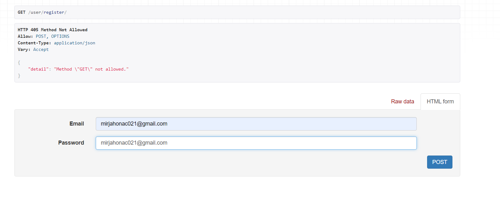
After registering you will receive verification message to your email address
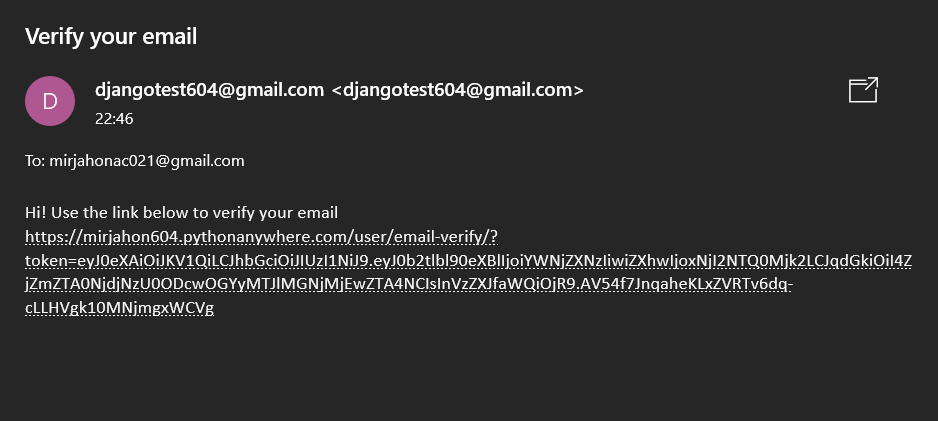
Via going through this link you can verify your email 
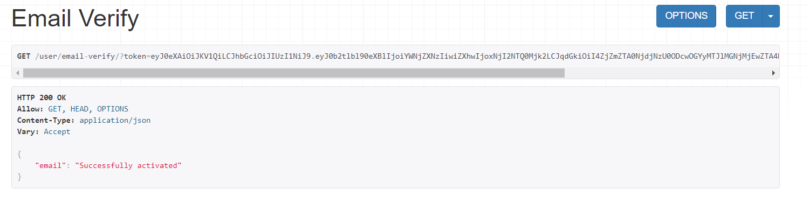
Email Verified
For email verification I used jwt. I generated token for particular user and used it for verification. For sending email I used smtp package

Only after verifiying your email you can login
https://mirjahon604.pythonanywhere.com/user/login/ 
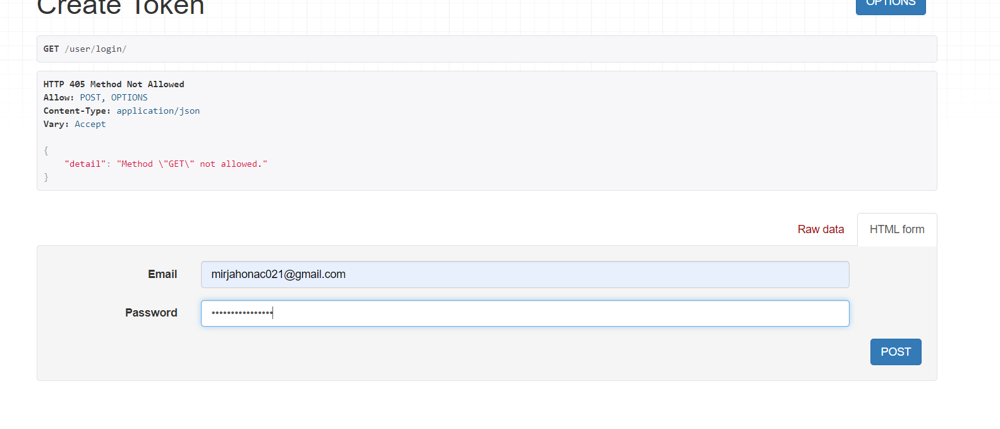
After entering valid email and password api returns token. It can be used in frontend side of website to identify user 
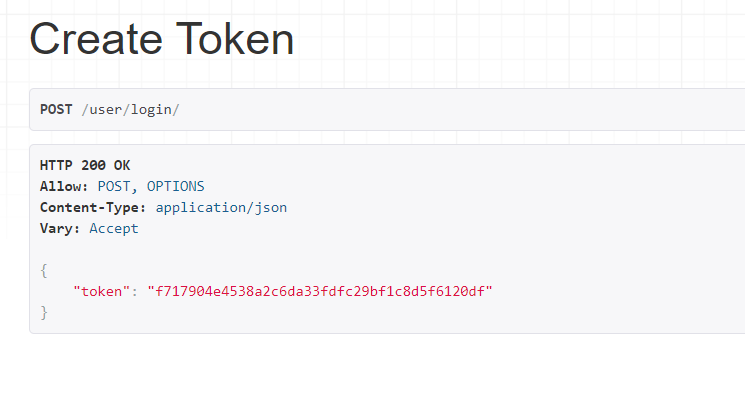
For authentication I used Token authentication. It can be used in frontend side of website to identify user.
We have only api so to test out we will use modheader extension to activate token
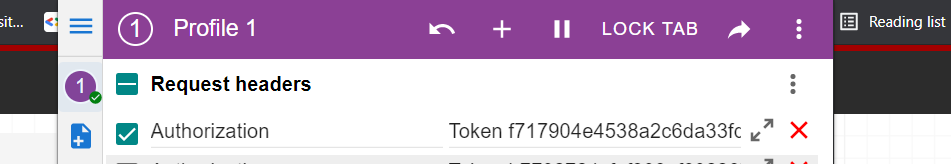

There you can see, update and delete your account
https://mirjahon604.pythonanywhere.com/user/me/
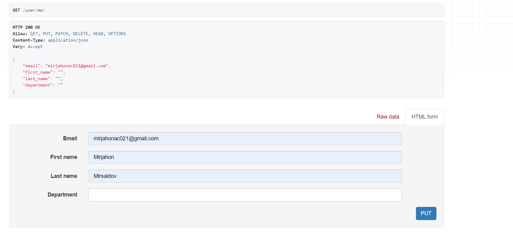
Now i'm gonna update user's first and last name
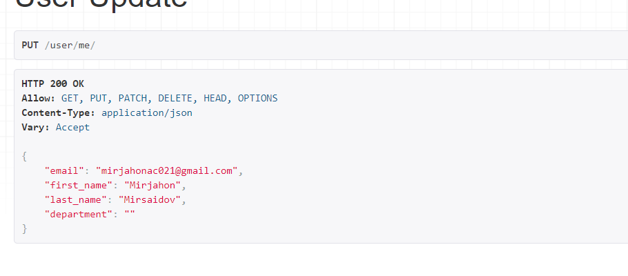
Now it's updated
You can also delete user by sending delete request

There you can update your password
https://mirjahon604.pythonanywhere.com/user/update-password/
You enter your email addres and password change message will send to this
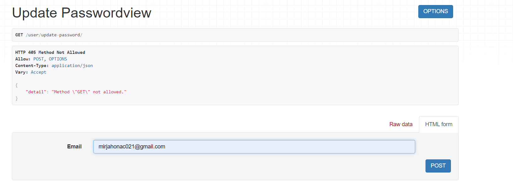
There is the message and by clicking the link you can update your password
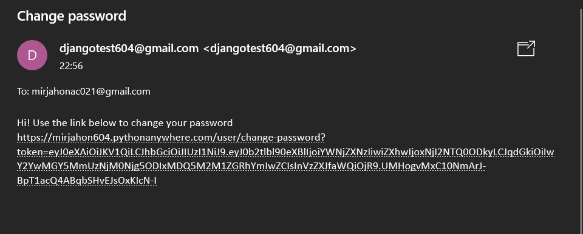
Password successfully changed
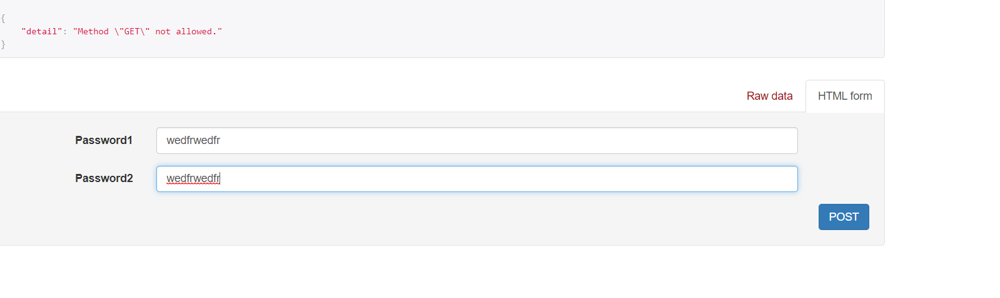
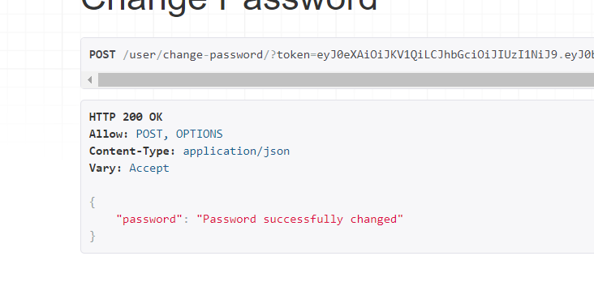

